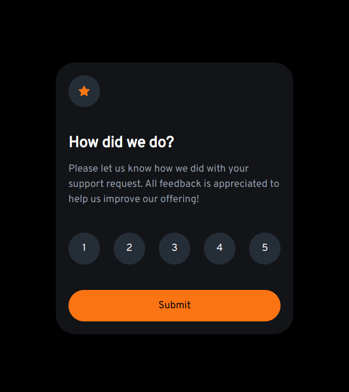

# Frontend Mentor - Interactive rating component solution

This is a solution to the [Interactive rating component challenge on Frontend Mentor](https://www.frontendmentor.io/challenges/interactive-rating-component-koxpeBUmI). Frontend Mentor challenges help you improve your coding skills by building realistic projects. 

## Table of contents

- [Overview](#overview)
  - [The challenge](#the-challenge)
  - [Screenshot](#screenshot)
  - [Links](#links)
- [My process](#my-process)
  - [Built with](#built-with)
  - [What I learned](#what-i-learned)
  - [Continued development](#continued-development)

- [Author](#author)


**Note: Delete this note and update the table of contents based on what sections you keep.**

## Overview

### The challenge

Users should be able to:

- View the optimal layout for the app depending on their device's screen size
- See hover states for all interactive elements on the page
- Select and submit a number rating
- See the "Thank you" card state after submitting a rating

### Screenshot




### Links

- Solution URL: [https://github.com/PeterEnglish/interactive-rating-component](https://github.com/PeterEnglish/interactive-rating-component)
- Live Site URL: [https://peterenglish.github.io/interactive-rating-component/](https://peterenglish.github.io/interactive-rating-component/)

## My process

### Built with

- Semantic HTML5 markup
- CSS custom properties
- Flexbox
- Mobile-first workflow
- JQuery
- Javascript


### What I learned

The main thing I learned over the course of this project was based on javascript, and in particular JQuery. I already had a good base of knowledge about Javascript, however I added JQuery to my arsenal, which simplifies the selection of tags and performing common functions on html elements.

An example of jquery in action:
```
```js
number_buttons.on("click", function() {
        number_buttons.removeClass("selected");
        $(this).addClass("selected");
        number = $(this).text().trim();
      });
```


### Continued development

I'd like to do another project in JQuery before returning to React, an old favourite of mine, for the projects that follow after.


## Author

- Frontend Mentor - [@PeterEnglish](https://www.frontendmentor.io/profile/PeterEnglish)

**Note: Delete this note and add/remove/edit lines above based on what links you'd like to share.**

